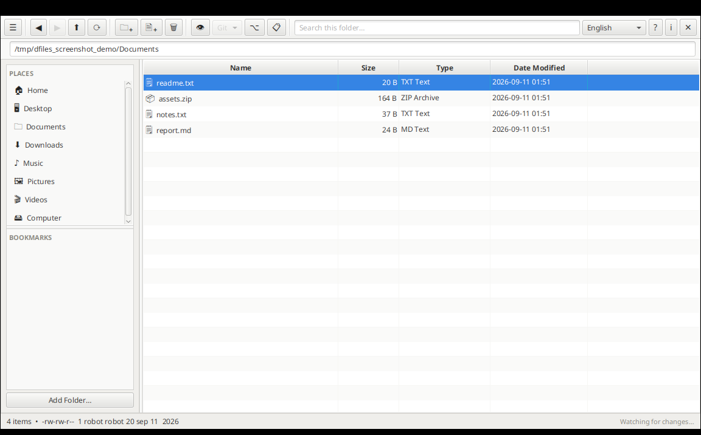

# DFiles

### A fast, modern file manager built with JavaFX

DFiles is a desktop file manager inspired by GNOME Files (Nautilus), built for people who want
a clean, keyboard- and mouse-friendly way to browse their filesystem without giving up quick
access to a terminal, Git, VS Code, and common archive/text operations. It keeps a small SQLite
cache so recently visited folders paint instantly, watches the current folder in the background
so external changes show up without a manual refresh, and stays out of your way with a resizable,
collapsible layout and full support for English, Spanish, French, and Portuguese.



## Features

- **Two-pane browsing** — a sidebar of standard Places (Home, Desktop, Documents, Downloads,
  Music, Pictures, Videos, Computer) plus user-defined Bookmarks, alongside a sortable file table
- **Resizable, collapsible layout** — drag the divider between the sidebar and the file table, drag
  the divider between Places and Bookmarks, and hide the whole sidebar with one click
- **Background folder watching** — the current folder updates live as files change on disk, with a
  SQLite-backed cache for instant repeat visits
- **Git integration** — status, pull, push, commit, log, and init, run from the toolbar with output
  shown inline
- **Archive support** — browse the contents of zip, tar, tar.gz, tar.bz2, tar.xz, rar, and 7z files,
  extract them in place, or compress any folder into a new archive, choosing from whichever formats
  are available on your system
- **Text file tools** — a head/tail viewer for quickly skimming large logs, and a find-and-replace
  dialog (plain text or regex) that always saves to a new versioned file, never overwriting the original
- **Terminal & VS Code shortcuts** — open a terminal or VS Code at the current or selected folder
  in one click
- **File properties** — Unix-style permissions, size, item counts, and modified dates, shown in the
  status bar for a single selection and in a full Properties dialog for any file or folder
- **Internationalized UI** — English, Español, Français, and Português, auto-detected from your OS
  locale on first launch and remembered after that
- **Built-in Help** — a bundled documentation page, one click away from the toolbar
- **Structured logging** — application activity and errors are logged to `~/.dfiles/dfiles.log`
  via Log4j2

## Requirements

- **Java 21** or later ([Eclipse Temurin](https://adoptium.net/) or any OpenJDK 21+ distribution)
- **Apache Maven 3.9+**
- **JavaFX 21.0.3** — fetched automatically by Maven; no separate SDK install needed
- Optional, for full functionality: `git`, a terminal emulator, `tar`/`unrar`/`7z` for non-zip
  archive support, and the VS Code `code` CLI

## Build

```bash
mvn package
```

This produces a self-contained runnable jar at `target/dfiles.jar` (via `maven-shade-plugin`),
bundling JavaFX, SQLite JDBC, and Log4j2.

## Run

During development, run directly with the JavaFX Maven plugin:

```bash
mvn javafx:run
```

Or run the packaged jar:

```bash
java -jar target/dfiles.jar
```

DFiles stores its settings, bookmarks, and file cache in `~/.dfiles/dfiles.sqlite`, and writes logs
to `~/.dfiles/dfiles.log`.

## Contributing

DFiles is open-source and started with development assistance from
[Claude Code](https://claude.com/claude-code), Anthropic's AI coding assistant. Voluntary
contributions are welcome — fork the repository and open a pull request.

## License

DFiles is licensed under the [GNU General Public License v3.0](LICENSE).
